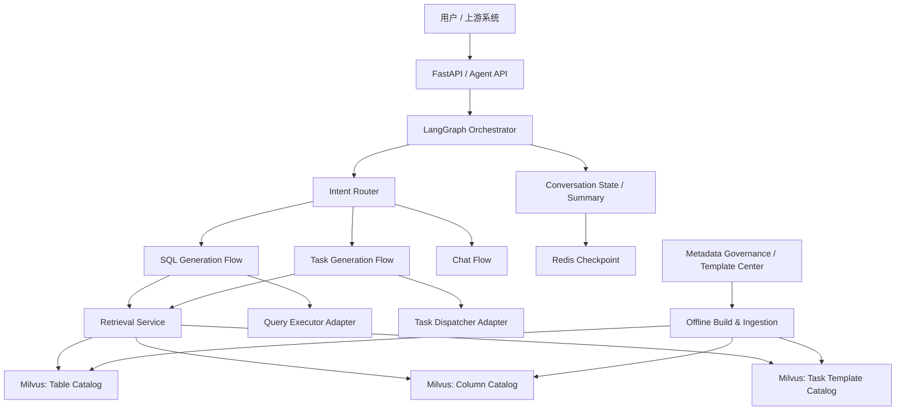

# DataPilot 架构优化与 RAG / Milvus 设计方案

## 1. 文档目的

本文档用于明确 DataPilot 下一阶段的目标架构，重点解决以下问题：

- 明确在线 Agent 服务与离线数据治理的职责边界
- 重新定义 RAG 与 Milvus 的专业化设计方式
- 为 SQL 生成、SQL 执行、任务模板检索、任务配置生成预留稳定接口
- 为后续扩展到更多数据资产、更多任务类型、更多执行器提供演进路径

本文档是面向实现的设计稿，不是宣传材料。

## 2. 当前项目定位与问题判断

### 2.1 当前定位

当前仓库本质上是一个数据场景 Agent 后端原型，核心能力是：

- 自然语言意图识别
- RAG 检索
- Text-to-SQL 生成
- Text-to-Task 配置生成
- 基础会话状态保存

它目前更接近“生成型 Agent 后端”，而不是“执行型数据平台”。

### 2.2 当前主要问题

- 在线检索服务承担了建集合、建索引、补 schema 的职责，边界不清
- `metadata_collection` 同时混装表和字段的设计不够专业
- 任务模板集合设计过粗，缺少模板分类、槽位、约束、适配条件等结构化信息
- SQL 生成所需的专业上下文不足，例如主键、时间列、分区列、可聚合字段、关联关系
- 缺少对外稳定接口，后续接 SQL 执行器、任务编排器时耦合会很重
- 缺少清晰的未来演进路线

## 3. 总体设计原则

### 3.1 在线只读，离线治理

在线服务只负责：

- 连接
- 校验
- 检索
- 生成
- 执行编排

在线服务不负责：

- 创建 collection
- 修改 collection schema
- 修复字段
- 回填治理数据
- 构建向量

集合、字段、索引、治理数据、检索文本、向量数据，都应由离线治理链路提前准备。

### 3.2 Milvus 是检索索引，不是元数据真源

Milvus 在本项目中的定位应是“检索服务索引层”，而不是唯一真源。

真正的真源应来自：

- 元数据中心
- 数据目录
- 表结构采集任务
- 任务模板中心
- 业务术语/指标口径中心

Milvus 中保存的是适合检索和召回的投影数据，而不是全部治理逻辑。

### 3.3 分集合、分粒度、分用途

不建议继续使用一个大而混杂的 `metadata_collection`。

更专业的做法是按粒度和用途拆分：

- 表级资产 collection
- 字段级资产 collection
- 任务模板 collection

后续再逐步补充：

- 指标口径 collection
- SQL 示例 collection
- 关联关系 / lineage collection
- 业务术语 collection

### 3.4 检索上下文必须服务于生成质量

RAG 不是“搜到点文本就行”，而是要为 SQL 生成和任务生成提供足够专业的约束信息。

对于 SQL：

- 应能拿到表级语义
- 应能拿到字段语义
- 应能拿到主键、时间列、分区列、枚举值、敏感级别
- 应能拿到常见 join 线索
- 应能拿到数据库方言和执行约束

对于任务生成：

- 应能拿到模板类型
- 应能拿到支持的数据源和目标源
- 应能拿到必填槽位和校验规则
- 应能拿到默认参数、约束条件、版本信息

## 4. 目标总体架构



## 5. 在线与离线职责边界

### 5.1 在线服务职责

- 接收请求
- 路由意图
- 调用检索服务
- 组织 Prompt / 结构化输出
- 执行 SQL 安全校验
- 调用执行器适配层
- 保存会话状态
- 输出可解释结果

### 5.2 离线治理职责

- 采集表结构和字段结构
- 补充业务注释、别名、归属域、责任人、权限标签
- 生成检索文本 `search_text`
- 生成 dense embedding
- 准备 sparse/BM25 检索字段
- 建 collection 和 index
- 数据入库和版本更新
- 模板中心治理与版本控制

### 5.3 启动时校验职责

在线服务启动后应只做校验，不做修复。

校验内容包括：

- Milvus 是否可连接
- 目标 collection 是否存在
- 关键字段是否齐全
- 向量维度是否匹配
- 关键索引是否存在
- 当前 schema version 是否在服务支持范围内

如不满足，服务应 fail fast。

## 6. Milvus collection 设计

## 6.1 命名原则

建议采用显式、可版本化命名，不使用过于泛化的名字。

推荐：

- `dp_table_catalog_v1`
- `dp_column_catalog_v1`
- `dp_task_template_v1`

命名规则：

- `dp` 为项目或域前缀
- 中间表示资产类型
- 末尾带版本号，便于平滑迁移

### 6.1.1 alias 策略

建议同时维护稳定 alias，而不是让在线服务直接依赖具体版本名。

推荐 alias：

- `dp_table_catalog_current` -> `dp_table_catalog_v1`
- `dp_column_catalog_current` -> `dp_column_catalog_v1`
- `dp_task_template_current` -> `dp_task_template_v1`

这样做的好处：

- 在线服务配置稳定，不必每次跟着 collection 版本改代码
- 离线迁移可以先写入新版本 collection，再切换 alias
- 支持蓝绿切换和快速回滚

推荐迁移步骤：

1. 创建新版本 collection
2. 导入并校验新版本数据
3. 预热向量索引和 sparse 索引
4. 切换 alias 到新版本
5. 观察线上表现
6. 再决定是否回收旧版本

## 6.2 通用设计原则

所有 collection 均建议遵守以下约束：

- 主键使用外部稳定 ID，不使用 `auto_id`
- `enable_dynamic_field` 建议关闭，保证 schema 严格可控
- 检索关键字段单独建显式列，不把全部信息塞进 JSON
- 原始治理快照可保存在单个 `payload` JSON 字段中
- 向量字段、检索文本字段、过滤字段分开设计
- 预留 `tenant_id`、`env`、`status`、`version` 等治理字段

通用字段建议如下：

| 字段 | 类型 | 用途 |
| --- | --- | --- |
| `doc_id` | `VARCHAR(64)` | 稳定主键，来自治理系统 |
| `tenant_id` | `VARCHAR(32)` | 多租户隔离 |
| `env` | `VARCHAR(16)` | 环境标识，dev/test/prod |
| `status` | `VARCHAR(16)` | `ACTIVE` / `DISABLED` / `DEPRECATED` |
| `schema_version` | `INT64` | schema 版本 |
| `search_text` | `VARCHAR(65535)` | BM25 / sparse 检索文本 |
| `dense_vector` | `FLOAT_VECTOR` | dense 语义向量 |
| `sparse_vector` | `SPARSE_FLOAT_VECTOR` | sparse 检索向量 |
| `payload` | `JSON` | 原始治理快照 |
| `updated_at` | `INT64` | 更新时间戳 |

索引建议：

- `dense_vector` 使用 `AUTOINDEX` 或按规模改为 HNSW / IVF
- `sparse_vector` 使用 `SPARSE_INVERTED_INDEX`
- 常用过滤字段保留为标量字段

## 6.3 表级资产 collection 设计

### 6.3.1 collection 名称

`dp_table_catalog_v1`

### 6.3.2 粒度定义

一条记录对应一个可被检索的“表级资产”。

这里的表级资产可以是：

- 物理表
- 逻辑表
- 视图
- 宽表
- 事实表
- 维表

### 6.3.3 目标

服务于 SQL 生成阶段的“候选表召回”和“表级语义理解”。

### 6.3.4 核心字段建议

| 字段 | 类型 | 是否必需 | 说明 |
| --- | --- | --- | --- |
| `doc_id` | `VARCHAR(64)` | 是 | 稳定表 ID |
| `datasource_id` | `VARCHAR(64)` | 是 | 数据源 ID |
| `catalog_name` | `VARCHAR(128)` | 否 | catalog |
| `database_name` | `VARCHAR(128)` | 是 | 数据库名 |
| `schema_name` | `VARCHAR(128)` | 否 | schema 名 |
| `table_name` | `VARCHAR(256)` | 是 | 表名 |
| `full_table_name` | `VARCHAR(512)` | 是 | 完整限定名 |
| `table_type` | `VARCHAR(32)` | 是 | `FACT` / `DIM` / `VIEW` / `LOGICAL` |
| `dialect` | `VARCHAR(32)` | 是 | `MYSQL` / `POSTGRESQL` / `CLICKHOUSE` / `DORIS` |
| `business_name` | `VARCHAR(256)` | 否 | 业务名称 |
| `aliases` | `JSON` | 否 | 同义词、简称、别名 |
| `business_domain` | `VARCHAR(128)` | 否 | 业务域 |
| `grain_desc` | `VARCHAR(512)` | 否 | 粒度说明 |
| `table_desc` | `VARCHAR(4096)` | 是 | 表描述 |
| `primary_keys` | `JSON` | 否 | 主键列表 |
| `partition_keys` | `JSON` | 否 | 分区键列表 |
| `time_columns` | `JSON` | 否 | 时间列列表 |
| `join_hints` | `JSON` | 否 | 常见关联关系提示 |
| `row_count_level` | `VARCHAR(32)` | 否 | 数据量级 |
| `freshness_sla` | `VARCHAR(64)` | 否 | 新鲜度要求 |
| `owner` | `VARCHAR(128)` | 否 | 负责人 |
| `security_level` | `VARCHAR(32)` | 否 | 数据安全级别 |
| `is_active` | `BOOL` | 是 | 是否可用 |
| `search_text` | `VARCHAR(65535)` | 是 | 离线拼装的检索文本 |
| `dense_vector` | `FLOAT_VECTOR` | 是 | dense 向量 |
| `sparse_vector` | `SPARSE_FLOAT_VECTOR` | 是 | sparse 向量 |
| `payload` | `JSON` | 否 | 原始完整元数据 |

### 6.3.5 search_text 组成建议

`search_text` 建议由以下信息离线拼装：

- 表名
- 完整表名
- 中文名 / 业务名
- 业务域
- 别名
- 表描述
- 粒度说明
- 关键字段摘要
- 主键/时间列/分区列摘要
- 常见业务问法

### 6.3.6 为什么不能只存表注释

如果只存表注释，SQL 生成时会缺少如下关键上下文：

- 哪个字段可作为统计口径
- 哪个字段是业务时间
- 哪些字段可以 join
- 哪张表是明细，哪张表是汇总
- 当前表是否允许查询

这会直接拉低 Text-to-SQL 的专业度。

## 6.4 字段级资产 collection 设计

### 6.4.1 collection 名称

`dp_column_catalog_v1`

### 6.4.2 粒度定义

一条记录对应一个字段级资产。

### 6.4.3 目标

服务于 SQL 生成阶段的“列级召回”和“字段约束补全”。

### 6.4.4 核心字段建议

| 字段 | 类型 | 是否必需 | 说明 |
| --- | --- | --- | --- |
| `doc_id` | `VARCHAR(64)` | 是 | 稳定字段 ID |
| `table_id` | `VARCHAR(64)` | 是 | 所属表 ID |
| `datasource_id` | `VARCHAR(64)` | 是 | 数据源 ID |
| `database_name` | `VARCHAR(128)` | 是 | 数据库名 |
| `table_name` | `VARCHAR(256)` | 是 | 表名 |
| `column_name` | `VARCHAR(256)` | 是 | 字段名 |
| `full_column_name` | `VARCHAR(768)` | 是 | 完整列限定名 |
| `business_name` | `VARCHAR(256)` | 否 | 中文名/业务名 |
| `aliases` | `JSON` | 否 | 同义词、简称 |
| `data_type` | `VARCHAR(64)` | 是 | 字段类型 |
| `semantic_type` | `VARCHAR(64)` | 否 | `ID` / `TIME` / `DIMENSION` / `METRIC` / `STATUS` |
| `metric_role` | `VARCHAR(64)` | 否 | `SUMMABLE` / `COUNTABLE` / `RATIO` / `NON_AGG` |
| `is_primary_key` | `BOOL` | 否 | 是否主键 |
| `is_foreign_key` | `BOOL` | 否 | 是否外键 |
| `is_nullable` | `BOOL` | 否 | 是否可空 |
| `is_partition_key` | `BOOL` | 否 | 是否分区键 |
| `is_time_column` | `BOOL` | 否 | 是否时间列 |
| `time_granularity` | `VARCHAR(32)` | 否 | 时间粒度 |
| `enum_values` | `JSON` | 否 | 枚举值摘要 |
| `sample_values` | `JSON` | 否 | 采样值摘要 |
| `unit` | `VARCHAR(32)` | 否 | 单位 |
| `aggregation_hints` | `JSON` | 否 | 建议聚合方式 |
| `join_hints` | `JSON` | 否 | 建议关联列 |
| `column_desc` | `VARCHAR(4096)` | 是 | 字段描述 |
| `security_level` | `VARCHAR(32)` | 否 | 敏感级别 |
| `is_queryable` | `BOOL` | 是 | 是否允许查询 |
| `search_text` | `VARCHAR(65535)` | 是 | 离线拼装检索文本 |
| `dense_vector` | `FLOAT_VECTOR` | 是 | dense 向量 |
| `sparse_vector` | `SPARSE_FLOAT_VECTOR` | 是 | sparse 向量 |
| `payload` | `JSON` | 否 | 原始完整元数据 |

### 6.4.5 search_text 组成建议

- 字段名
- 完整字段名
- 中文名 / 业务名
- 所属表名 / 业务域
- 字段描述
- 枚举值摘要
- 采样值摘要
- 典型业务问法
- 聚合/过滤/排序建议

### 6.4.6 为什么字段 collection 必须独立

如果字段只作为表记录中的一部分 JSON 存在，会导致：

- 列级召回不准
- 模型只能看到表级大段文本，列细节被稀释
- 对“销售额”“下单时间”“活跃状态”这类字段查询不敏感
- 无法按字段级别做权限和质量控制

专业的 Text-to-SQL 基本都需要表级和字段级双通道检索。

## 6.5 任务模板 collection 设计

### 6.5.1 collection 名称

`dp_task_template_v1`

### 6.5.2 粒度定义

一条记录对应一个“可复用任务模板定义”。

模板类型可以包括：

- 数据同步任务
- 数据迁移任务
- ETL 作业
- 周期抽取任务
- SQL 报表任务
- 质量检查任务
- 对账任务

### 6.5.3 目标

服务于任务生成链路的模板召回、槽位填充和规则校验。

### 6.5.4 核心字段建议

| 字段 | 类型 | 是否必需 | 说明 |
| --- | --- | --- | --- |
| `doc_id` | `VARCHAR(64)` | 是 | 稳定模板 ID |
| `template_code` | `VARCHAR(128)` | 是 | 模板编码 |
| `template_name` | `VARCHAR(256)` | 是 | 模板名称 |
| `template_type` | `VARCHAR(64)` | 是 | `SYNC` / `MIGRATION` / `ETL` / `REPORT` / `DQC` |
| `business_domain` | `VARCHAR(128)` | 否 | 适用业务域 |
| `source_types` | `JSON` | 是 | 支持的数据源类型 |
| `target_types` | `JSON` | 否 | 支持的目标类型 |
| `schedule_modes` | `JSON` | 否 | 支持的调度方式 |
| `required_slots` | `JSON` | 是 | 必填槽位定义 |
| `optional_slots` | `JSON` | 否 | 可选槽位定义 |
| `slot_schema` | `JSON` | 是 | 槽位类型与校验规则 |
| `compatibility_rules` | `JSON` | 否 | 源/目标兼容约束 |
| `default_payload` | `JSON` | 否 | 默认配置 |
| `payload_schema` | `JSON` | 是 | 任务配置 JSON schema |
| `render_rules` | `JSON` | 否 | 模板渲染规则 |
| `example_inputs` | `JSON` | 否 | 用户表达样例 |
| `example_payloads` | `JSON` | 否 | 生成结果样例 |
| `template_desc` | `VARCHAR(4096)` | 是 | 模板描述 |
| `risk_level` | `VARCHAR(32)` | 否 | 任务风险等级 |
| `version_name` | `VARCHAR(64)` | 是 | 模板版本 |
| `is_active` | `BOOL` | 是 | 是否可用 |
| `search_text` | `VARCHAR(65535)` | 是 | 离线拼装检索文本 |
| `dense_vector` | `FLOAT_VECTOR` | 是 | dense 向量 |
| `sparse_vector` | `SPARSE_FLOAT_VECTOR` | 是 | sparse 向量 |
| `payload` | `JSON` | 否 | 模板完整治理快照 |

### 6.5.5 为什么任务模板不能只存 `content + payload`

如果只存一段描述和一个 payload：

- 检索只能靠模糊相似度
- 模型不知道哪些参数是必填
- 模型不知道源库和目标库是否兼容
- 模型不知道调度方式是否支持
- 模型不知道最终 JSON 应满足什么 schema

这会导致任务生成能力停留在 demo 水平，而不是专业配置生成。

## 6.6 不建议的 collection 设计

以下方案不建议采用：

- 一个 `metadata_collection` 同时存表和字段
- 一个模板集合里混不同任务类型但无类型字段
- 主键用 `auto_id`
- 所有治理属性全塞 `payload`，标量字段极少
- 在线请求阶段自动创建或修复 collection

## 6.7 检索策略建议

collection 设计只是基础，真正影响效果的是“先过滤，再召回，再重排”。

### 6.7.1 表级检索

建议先做硬过滤，再做混合召回：

- `tenant_id`
- `env`
- `status=ACTIVE`
- `datasource_id` 或 `dialect`
- `business_domain`，如果上游已识别到

再做：

- dense 语义召回
- sparse/BM25 关键词召回
- 规则重排

规则重排可参考：

- 表名命中权重
- 业务名命中权重
- 主时间列是否匹配
- 业务域是否匹配
- 近期是否被高频使用

### 6.7.2 字段级检索

字段检索强烈建议绑定候选表范围，不要全库裸搜。

建议过滤：

- `table_id in candidate_table_ids`
- `status=ACTIVE`
- `is_queryable=true`

再做列级召回和重排。

规则重排可参考：

- 字段名是否直接命中
- 中文别名是否命中
- `semantic_type` 是否与问题一致
- `metric_role` 是否匹配统计需求
- 是否为时间列 / 分区列 / join 列

### 6.7.3 模板检索

模板检索建议先过滤后召回：

- `template_type`
- `status=ACTIVE`
- `source_types`
- `target_types`
- `business_domain`
- `version_name`

召回后再按以下信号重排：

- 任务类型匹配度
- 源/目标兼容度
- required slots 覆盖度
- 风险等级
- 模板版本优先级

模板检索不建议长期只取 Top1，推荐取 Top3 或 Top5 进入二次判定。

## 7. SQL 生成与执行链路设计

## 7.1 SQL 生成链路

建议拆成以下步骤：

1. 路由识别：判断是 SQL 查询
2. 查询理解：抽取时间范围、指标、维度、过滤条件、排序、TopN 等意图元素
3. 表级召回：从 `dp_table_catalog_v1` 检索候选表
4. 列级召回：结合候选表，从 `dp_column_catalog_v1` 检索关键字段
5. 关系补全：结合主键、外键、join hints、时间列、分区列生成结构化上下文
6. SQL 生成：基于结构化上下文输出 SQL
7. SQL 校验：语法、方言、白名单、权限、危险操作校验
8. 可选执行：通过执行器适配层执行
9. 执行后处理：结果摘要、字段解释、血缘提示

## 7.2 SQL 生成需要的专业上下文

最低应包括：

- 候选表列表
- 每张表的业务定位
- 关键字段及字段含义
- 主键/外键/join 提示
- 时间字段和推荐时间口径
- 可聚合字段与推荐聚合方式
- 分区列与查询裁剪建议
- 方言信息
- 安全和权限标签

没有这些上下文，SQL 生成质量很难稳定。

## 7.3 SQL 执行适配层预留

建议预留统一接口，而不是直接在 node 中操作数据库。

建议接口形态：

- `validate(sql, context) -> ValidationResult`
- `dry_run(sql, context) -> ExplainResult`
- `execute(sql, context) -> QueryResult`

后续可对接：

- MySQL
- PostgreSQL
- ClickHouse
- Doris
- Spark SQL

## 8. 任务生成链路设计

## 8.1 任务生成链路

建议拆成以下步骤：

1. 路由识别：判断是任务创建
2. 任务理解：抽取任务类型、源、目标、对象、周期、过滤条件等
3. 模板召回：从 `dp_task_template_v1` 召回 TopK 模板
4. 模板重排：按任务类型、源/目标兼容性、风险等级、可用状态过滤
5. 槽位填充：根据模板要求补全参数
6. 缺参追问：只追问必填且当前无法推断的槽位
7. JSON 渲染：按 `payload_schema` 输出结构化配置
8. 校验：schema 校验、兼容性校验、命名校验、调度校验
9. 可选下发：通过任务分发器提交

## 8.2 任务模板的专业化标准

一个专业模板至少要回答这些问题：

- 适用于什么类型的任务
- 支持哪些源和目标
- 哪些参数是必须的
- 参数类型是什么
- 参数之间有什么依赖关系
- 生成后的 JSON 必须满足什么结构
- 模板当前是否可用

## 8.3 任务分发适配层预留

建议预留统一接口：

- `validate_task(config, context) -> ValidationResult`
- `preview_task(config, context) -> PreviewResult`
- `submit_task(config, context) -> SubmitResult`

后续可对接：

- Airflow
- DolphinScheduler
- 自研任务平台
- 数据同步平台

## 9. 对外扩展接口设计

## 9.1 元数据治理接入接口

建议独立于在线 Agent，对外提供离线接入能力：

- `upsert_table_assets(batch)`
- `upsert_column_assets(batch)`
- `upsert_task_templates(batch)`
- `disable_assets(ids)`
- `rebuild_vectors(ids)`

这些接口的落点不一定直接暴露 HTTP，也可以是：

- 内部任务脚本
- MQ 消费
- ETL pipeline
- 批量文件导入

## 9.2 检索服务抽象接口

在线服务不要直接依赖 Milvus 客户端细节，建议引入仓储层：

- `TableCatalogRepository`
- `ColumnCatalogRepository`
- `TaskTemplateRepository`

接口示意：

- `search_tables(query, filters, top_k)`
- `search_columns(query, table_ids, filters, top_k)`
- `search_templates(query, filters, top_k)`
- `get_table_by_id(id)`
- `get_columns_by_table_id(id)`

这样后续替换 Milvus 或补加 rerank 都不会影响上层节点。

## 9.3 解释与审计接口

建议预留：

- 检索 trace
- 使用了哪些表和字段
- 使用了哪一个模板
- 为什么拦截 SQL
- 为什么要求补充某些参数

这对后续排障、审核和运营非常重要。

## 10. 推荐的模块拆分

建议未来代码结构向下列方向演进：

```text
app/
  api/
  orchestration/
  domain/
    retrieval/
    sql/
    task/
    memory/
  infrastructure/
    milvus/
    redis/
    llm/
    executors/
    dispatchers/
  governance/
    ingestion/
    schema_validation/
  contracts/
    dto/
    schemas/
```

核心思想是把：

- 编排
- 领域逻辑
- 基础设施
- 治理链路

拆开，而不是都压在 node 和 service 中。

## 11. 分阶段落地路线

## 11.1 第一阶段：架构收口

目标：

- 在线服务只读化
- RAG collection 专业化
- 统一治理与入库流程

重点工作：

- 去掉运行时自动建 collection
- 新建 collection bootstrap / migration 脚本
- 按表、字段、模板拆分 collection
- 统一 schema version 和命名
- 增加服务启动校验

## 11.2 第二阶段：生成能力增强

目标：

- 明显提升 SQL 和任务生成质量

重点工作：

- SQL 查询理解结构化
- 表级/字段级双通道召回
- 模板 TopK 召回 + 重排
- JSON schema 校验
- 更清晰的缺参追问逻辑

## 11.3 第三阶段：执行闭环

目标：

- 从“生成型 Agent”升级到“可执行 Agent”

重点工作：

- 接 SQL 执行器
- 接任务分发器
- 增加审计与确认机制
- 增加权限与风险控制

## 11.4 第四阶段：知识扩展

目标：

- 把系统从“表和模板”扩展成“数据知识网络”

可新增 collection：

- `dp_metric_catalog_v1`
- `dp_business_term_v1`
- `dp_sql_example_v1`
- `dp_join_pattern_v1`
- `dp_lineage_hint_v1`

## 12. 对当前项目的直接建议

结合当前仓库，建议优先做如下改造：

1. 删除 `MilvusService` 中在线建 collection 的逻辑，改成启动校验
2. 用新的 collection 设计替代现有 `metadata_collection`
3. 表和字段拆库后，SQL 节点改成两段检索
4. 模板集合改成结构化模板中心，而不是简单 `content + payload`
5. 在应用层增加 repository 抽象，隔离 Milvus 细节
6. 在未来执行阶段增加 `QueryExecutor` 和 `TaskDispatcher` 适配口

## 13. 最终结论

DataPilot 下一阶段不应继续沿着“在线服务顺手建集合、顺手补结构”的方向前进。

更合理的目标是：

- 离线治理负责准备专业数据资产
- Milvus 负责承载检索索引
- 在线 Agent 负责理解、召回、生成、校验、执行编排

只有把表级资产、字段级资产、任务模板拆开治理，并为执行层和外部接入层留好接口，这个项目后面才有机会从一个 demo 变成真正专业的数据智能 Agent。
